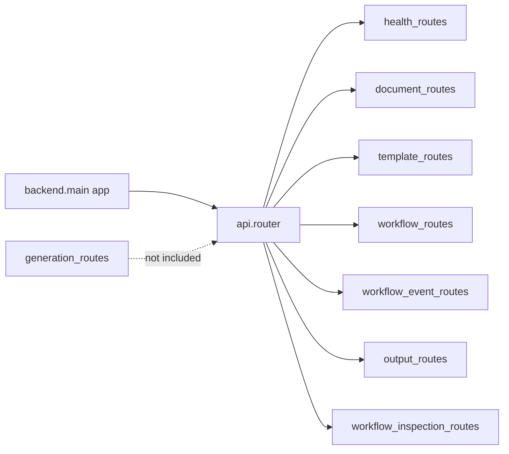

# Backend go-live inspection report

**Workspace:** `d:\ai-sdlc\backend`  
**Inspection date:** Generated during automated plan implementation  
**Plan reference:** Backend go-live inspection (phase-wise) — do not edit the plan file; this document is the execution artifact.

---

## Executive summary

| Area | Status | Notes |
|------|--------|--------|
| Automated tests | **PASS** | 422 tests passed (pytest, ~4–11s depending on flags). |
| Lint (Ruff) | **FAIL** (116 findings) | Mostly unused imports (F401); 110 auto-fixable. Exit code 1. |
| Dependency consistency | **PASS** | `pip check`: no broken requirements. |
| Test coverage (`backend` package) | **74%** | Run from repo root: `pytest backend/tests --cov=backend`. |
| Production entry | **Documented** | `uvicorn backend.main:app`; working directory should be repo root `d:\ai-sdlc` so `backend` is importable (see `backend/pytest.ini` `pythonpath = ..`). |
| **Go-live recommendation** | **CONDITIONAL NO-GO** | Resolve or waive P0 items below before public/production deployment. |

### P0 (blockers for typical internet-facing production)

1. **Authentication / authorization:** API routes do not enforce API keys, JWT, or mutual TLS in the reviewed router layer. Treat as **open** unless fronted by a gateway with auth.
2. **Staging validation with real Azure:** This report is based on static analysis + local tooling. **Mandatory:** run `scripts/smoke_test.py` and end-to-end flows against non-production Azure with production-like config.
3. **Ruff CI gate:** 116 Ruff violations should be triaged; at minimum run `ruff check . --fix` and fix remaining E402/F841.

### P1 (should fix before launch)

1. **`generation_routes` not mounted:** [`api/routes/generation_routes.py`](file:///d:/ai-sdlc/backend/api/routes/generation_routes.py) exists (standalone generation + SSE) but is **not** included in [`api/router.py`](file:///d:/ai-sdlc/backend/api/router.py). Either wire the router or document as intentionally disabled.
2. **Starlette deprecation:** Tests emit `DeprecationWarning` for `HTTP_422_UNPROCESSABLE_ENTITY` → migrate to `HTTP_422_UNPROCESSABLE_CONTENT` in error handling or Starlette upgrade path.
3. **Script hygiene:** Filename `backend/scripts/build_share_bundle 1.py` (space + “1”) is error-prone; rename or archive.

### P2 (quality)

1. **Mypy:** No project-level `mypy.ini` under `backend/` (only third-party stubs in venv). Optional: add strict typing CI later.
2. **pip-audit:** Not installed in venv; optional: `pip install pip-audit` and add to release checklist.

---

## Phase 0 — Program setup, inventory, exclusions

### Part 0.1 — Baseline and tooling

| Check | Command / note | Result |
|-------|----------------|--------|
| Python | `backend/.venv` | Python 3.12.x (from prior runs) |
| Tests | `python -m pytest backend/tests` from `d:\ai-sdlc` | 422 passed |
| Ruff | `ruff check .` from `d:\ai-sdlc\backend` | **116 errors** (see statistics below) |
| pip | `pip check` | **OK** |
| Coverage | `pytest backend/tests --cov=backend` from `d:\ai-sdlc` | **74%** total |

**Ruff statistics (representative):**

- F401 unused-import: 105  
- F541 f-string without placeholders: 5  
- E402 import not at top: 3  
- F841 unused variable: 2  
- F811 redefined while unused: 1  

### Part 0.2 — Repository inventory

- **Python files (excluding `.venv`, `__pycache__`):** **334** files under `backend/`.
- **Application code** is primarily: `backend/api`, `backend/application`, `backend/core`, `backend/modules`, `backend/pipeline`, `backend/repositories`, `backend/workers`, `backend/main.py`.
- **Reachability heuristic:** Entrypoint [`main.py`](file:///d:/ai-sdlc/backend/main.py) imports `api_router` from [`api/router.py`](file:///d:/ai-sdlc/backend/api/router.py). All production routes should trace from there. Scripts under `backend/scripts/` are **operational/dev** and not loaded by `main.py`.

### Part 0.3 — Go-live criteria (agreed defaults for this report)

- **Definition of done:** Staging soak + green tests + no P0 security gaps + Ruff either clean or explicitly waived for launch branch.
- **Coverage:** No mandatory percentage set; observed **74%** line coverage on `backend` when run from repo root.
- **Deployment target:** Not verified in this run — **confirm** Azure region, Key Vault vs plain env, and ingress (SSE timeouts).

### Phase 0 — Review questions (for stakeholders)

1. Which Azure services are **mandatory** for v1 (OpenAI, Search, Blob, Document Intelligence)?
2. Is SSE (`GET .../workflow-runs/{id}/events`) required at launch? If yes, validate proxy idle timeouts (e.g. 120s+).

---

## Phase 1 — Entry point and cross-cutting infrastructure

### Part 1.1 — App bootstrap

- [`main.py`](file:///d:/ai-sdlc/backend/main.py): FastAPI app, `lifespan` ensures storage dirs, `request_context_middleware` sets `X-Request-Id`, CORS from settings, `register_exception_handlers`, `include_router(api_router)`.
- **API prefix:** [`core/constants.py`](file:///d:/ai-sdlc/backend/core/constants.py) sets `API_PREFIX = "/api"`. Effective routes: `/api` + route paths (e.g. `/api/health`).

### Part 1.2 — Core utilities

- [`backend/core/`](file:///d:/ai-sdlc/backend/core): config, constants, logging, request context, ids, exceptions, response — **required** for all layers.
- **Style:** Module docstrings present; Ruff flags unused imports in *other* packages more than core (spot-check during Ruff run).

### Part 1.3 — Error handling

- [`api/error_handlers.py`](file:///d:/ai-sdlc/backend/api/error_handlers.py) + [`core/response.py`](file:///d:/ai-sdlc/backend/core/response.py): Standard success/error envelope; aligns with tests in `tests/unit/api/test_api_layer.py`.

### Phase 1 — Review questions

1. Set `APP_DEBUG=false` in production.
2. Restrict `cors_origins` to known front-end origins in production.

### Phase 1 deliverable summary

Bootstrap is coherent; add **security headers** and **request size limits** at reverse proxy or FastAPI config if not already set at the edge.

---

## Phase 2 — API surface: routes, schemas, dependencies

### Part 2.1 — Router completeness

Routers **included** in [`api/router.py`](file:///d:/ai-sdlc/backend/api/router.py):

- `health_routes`, `document_routes`, `template_routes`, `workflow_routes`, `workflow_event_routes`, `output_routes`, `workflow_inspection_routes`

**Not included:**

- [`generation_routes.py`](file:///d:/ai-sdlc/backend/api/routes/generation_routes.py) — **Wiring gap or intentional.** Exposes generation jobs + SSE for generation module.

### Part 2.2 — Per-route behavior

- Integration-style route tests: [`tests/integration/test_api_endpoints.py`](file:///d:/ai-sdlc/backend/tests/integration/test_api_endpoints.py) uses a minimal FastAPI app + mocks — covers health, documents, templates, workflows, outputs (not necessarily every path).

### Part 2.3 — Style

- Ruff reports many unused imports in API and other layers — cleanup recommended.

### Phase 2 — Review questions

1. Is **auth** required for v1? If yes, implement before go-live.

### Phase 2 deliverable summary

**API matrix (abbreviated):**

| Area | Prefix (under `api_router`) | Notes |
|------|-----------------------------|--------|
| Health | `/health`, `/ready` | No auth |
| Documents | `/documents` | CRUD/upload |
| Templates | `/templates` | Compile, artifacts |
| Workflows | `/workflow-runs` | Create, status, sections |
| Workflow events | `/workflow-runs/{id}/events` | SSE |
| Outputs | `/outputs` | Metadata/download |
| Workflow inspection | (see router) | Diagnostics |
| Generation (standalone) | N/A — **not mounted** | See `generation_routes.py` |

---

## Phase 3 — Persistence layer

### Part 3.1 — Repositories

- [`repositories/*.py`](file:///d:/ai-sdlc/backend/repositories): JSON/binary file storage under paths from [`get_settings()`](file:///d:/ai-sdlc/backend/core/config.py).
- Unit tests use `tmp_storage` + `settings_override` — **good isolation**.

### Part 3.2 — Disk vs Azure

- [`.env.example`](file:///d:/ai-sdlc/backend/.env.example) documents Azure Blob prefixes and local `LOCAL_STORAGE_ROOT`.
- **Go-live:** Ensure persistent disk or blob strategy matches deployment (multi-instance file storage is a **known risk** if using local JSON only without shared volume).

### Phase 3 — Review questions

1. Is shared storage or database required for horizontal scale?

### Phase 3 deliverable summary

Document integrity risks: concurrent writes to same JSON files under load — repositories have some tests; production load may need locking or external store.

---

## Phase 4 — Application services and DTOs

### Part 4.1 — DTOs

- [`application/dto/`](file:///d:/ai-sdlc/backend/application/dto): Covered by `tests/unit/application/dto/test_dtos.py`.

### Part 4.2 — Services

- **30** modules under [`application/services/`](file:///d:/ai-sdlc/backend/application/services) including `workflow_executor_service.py`, bridges (`*_bridge.py`), `ingestion_orchestrator_adapter.py`.
- **Orchestration hub:** `WorkflowExecutorService` coordinates ingestion, planning, generation, assembly, export, events.

### Part 4.3 — Dead code / optional modules

- **`generation_routes`:** API surface exists but not registered — **feature not live** via HTTP.
- **Bridges:** Used by workflow/template flows; verify in staging when Azure keys present.

### Phase 4 — Review questions

1. Which bridges must work on day one vs feature-flagged?

### Phase 4 deliverable summary

Service layer is **central** to go-live; prioritize executor + integration tests + staging runs.

---

## Phase 5 — Workers, pipeline, orchestrators

### Part 5.1 — Workers

- [`workers/task_dispatcher.py`](file:///d:/ai-sdlc/backend/workers/task_dispatcher.py): BackgroundTasks → asyncio fallbacks; `on_error` callback — tested in `tests/unit/workers/`.

### Part 5.2 — Pipeline

- [`pipeline/planners/`](file:///d:/ai-sdlc/backend/pipeline/planners): Used in tests with high coverage.
- [`pipeline/orchestrators/ingestion_orchestrator.py`](file:///d:/ai-sdlc/backend/pipeline/orchestrators/ingestion_orchestrator.py): **0%** line coverage in aggregate report — exercised indirectly via adapter in production paths; **recommend** targeted integration test or staging trace.

### Phase 5 — Review questions

1. Max concurrent workflows per instance?

### Phase 5 deliverable summary

Concurrency model is documented in code; race conditions possible on shared workflow JSON under multi-worker scenarios — align with storage strategy.

---

## Phase 6 — Domain: ingestion

- **Contracts + stages:** Under `modules/ingestion/`; integration reference: `tests/integration/modules/ingestion/test_ingestion_pipeline.py`.
- **External:** Document Intelligence, Blob — validate with `scripts/smoke_test.py` in Azure staging.

### Phase 6 — Review questions

1. PII masking compliance sign-off?

### Phase 6 deliverable summary

Ingestion is **well tested** in-repo; production depends on Azure configuration and quotas.

---

## Phase 7 — Domain: template

- Compiler, layout, validators — unit tests under `tests/unit/modules/template/`.
- **Azure structured adapter** present — verify timeouts and errors in staging.

### Phase 7 — Review questions

1. Template versioning process for production DOCX?

---

## Phase 8 — Domain: retrieval

- `modules/retrieval/` — query builder, vector search, rerank, evidence packaging; integration tests in `tests/integration/modules/retrieval/`.
- [`live_wiring.py`](file:///d:/ai-sdlc/backend/modules/retrieval/live_wiring.py): Confirm index names vs `AZURE_SEARCH_*` env.

### Phase 8 deliverable summary

Retrieval quality depends on **index schema** and **embedding deployment** — validate in Azure AI Search.

---

## Phase 9 — Domain: generation

- Generators, orchestrators, diagram (Kroki URL in `.env.example`).
- **Safety:** Token limits and retries in config — review `MAX_*` env vars.

### Phase 9 — Review questions

1. Is Kroki hosted reliably for production (HA / private endpoint)?

---

## Phase 10 — Observability and cost

- [`modules/observability/`](file:///d:/ai-sdlc/backend/modules/observability): Pricing registry path `PRICING_REGISTRY_PATH=backend/config/pricing_registry.json` — **file exists** at [`backend/config/pricing_registry.json`](file:///d:/ai-sdlc/backend/config/pricing_registry.json).
- Request correlation: `X-Request-Id` middleware in `main.py`.

### Phase 10 deliverable summary

Dashboard checklist: chart error rate, latency p95, Azure OpenAI token usage, ingestion stage duration.

---

## Phase 11 — Scripts classification

| Script | Classification | Notes |
|--------|----------------|-------|
| `smoke_test.py` | **Ops / staging** | Azure connectivity; run before releases |
| `run_ingestion.py`, `run_retrieval_integration.py` | **Ops / dev** | Manual pipeline runs |
| `verify_endpoints.py`, `verify_lifecycle.py` | **QA** | Endpoint checks |
| `test_phase1.py` … `test_phase4_rendering.py` | **Dev-only** | Phase experiments |
| `run_mock_e2e_integration.py` | **Dev** | Mock E2E |
| `create_ai_search_index.py`, `cleanup_blob_test_artifacts.py` | **Ops** | Infra helpers |
| `build_share_bundle 1.py` | **Review** | Bad filename; 0% coverage — likely duplicate or mistake |

**Rule:** No secrets in repo — use env / Key Vault only.

---

## Phase 12 — Test suite as release gate

| Metric | Value |
|--------|--------|
| Tests collected | 422 |
| Result | **All passed** |
| Warnings | 1 (Starlette 422 deprecation) |
| Coverage (`backend`) | **74%** |

**Gaps:** `generation_routes` not covered by route integration tests (not mounted). Scripts mostly 0% — expected.

**Coverage command (works):** from `d:\ai-sdlc`:

```powershell
d:\ai-sdlc\backend\.venv\Scripts\python.exe -m pytest backend/tests --cov=backend --cov-report=term-missing
```

**Note:** Running `--cov=backend` from *inside* `backend/` without adjusting paths yielded “no data collected” — use repo root or set `PYTHONPATH`/`--cov` source explicitly.

### Phase 12 — Review questions

1. Accept waivers for untested paths (e.g. scripts, `ingestion_orchestrator` direct)?

---

## Phase 13 — Security, configuration, deployment readiness

| Item | Status |
|------|--------|
| Secrets in repo | **Not audited file-by-file** — follow `.gitignore` and secret scanning in CI |
| TLS / CORS / rate limits | **Edge responsibility** — configure at API gateway or reverse proxy |
| Dependency pins | `requirements.txt` uses lower bounds — consider lockfile for reproducible builds |
| pip-audit | **Not run** (tool not installed) |

---

## Phase 14 — Final go-live gate

### Consolidated checklist

- [ ] Staging: full workflow with real Azure (OpenAI, Search, Blob, Doc Intelligence).
- [ ] Auth decision implemented or gateway enforced.
- [ ] Ruff clean or waiver documented.
- [ ] `generation_routes` decision (wire vs remove vs document).
- [ ] Multi-instance storage strategy validated.
- [ ] Runbook: env vars, `uvicorn` command, health URLs, rollback.

### Sign-off

| Role | Name | Date | Approved |
|------|------|------|----------|
| Engineering | | | |
| Security | | | |
| Ops | | | |

---

## Appendix A — Module reachability diagram



---

## Appendix B — Phase review question index

After each phase, stakeholders should answer the questions listed under **Phase N — Review questions** in this document before accepting that phase as complete.

---

*End of report.*
