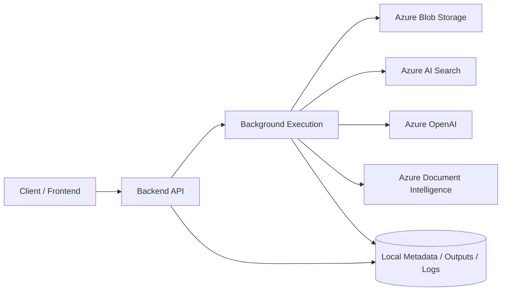
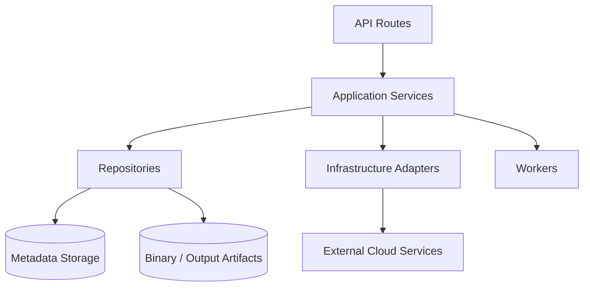
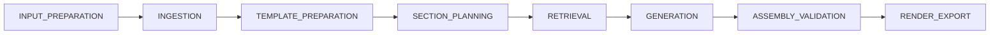
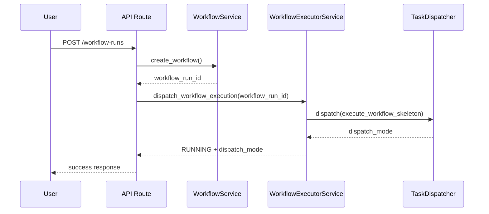
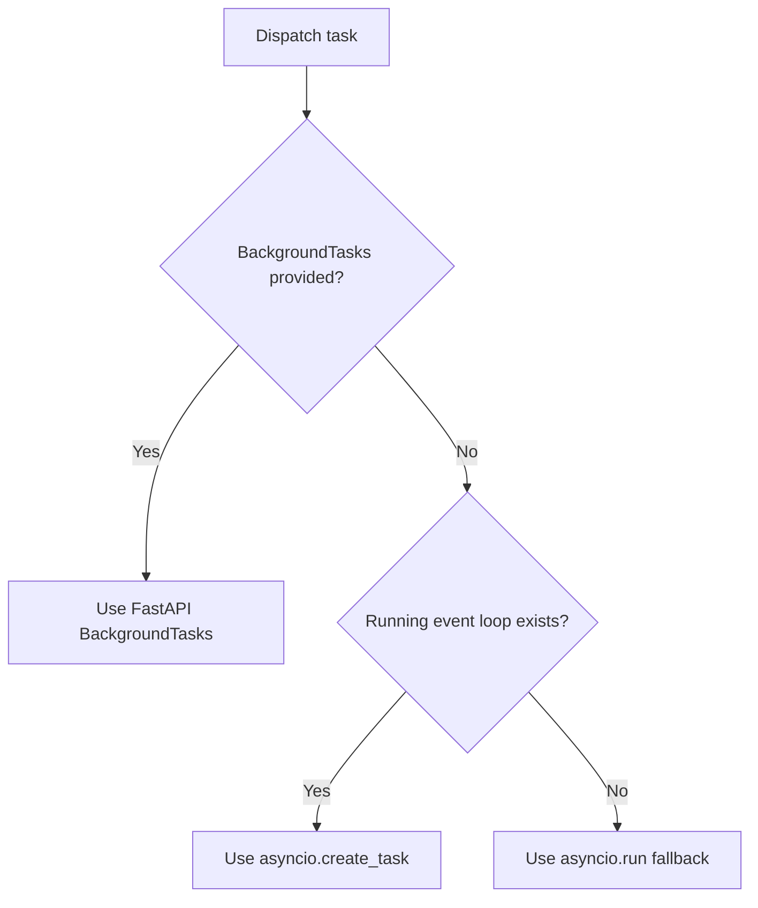
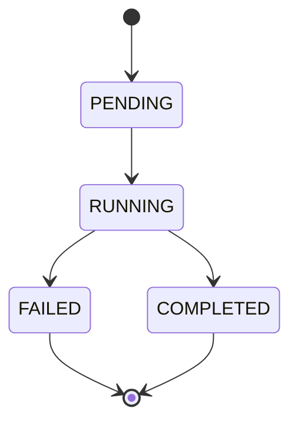
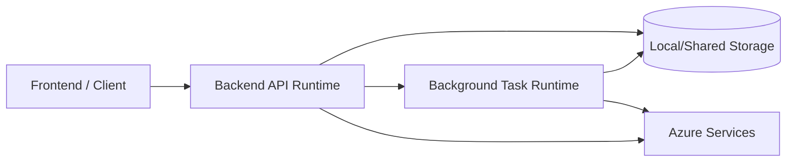
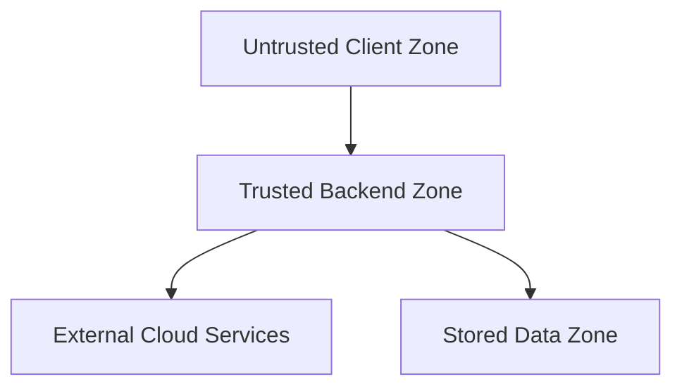

# Project Diagrams Master Guide

This document defines all diagrams that should exist to understand the project end-to-end at an industrial level.

It is organized by audience and purpose:
- Leadership/architecture views
- Developer implementation views
- Runtime/operations views
- Security/reliability views

Where possible, this guide includes Mermaid templates you can adapt directly.

---

## 1) Diagram Inventory (What to Create)

### A. System and Architecture
1. System Context Diagram
2. Container Diagram (API, workers, external services, storage)
3. Component Diagram (inside backend app)
4. Module Boundaries Diagram (`ingestion`, `retrieval`, `generation`, `template`, `observability`)
5. Layered Architecture Diagram (`api -> application -> repositories/infrastructure/workers`)

### B. Execution and Flow
6. End-to-End Workflow Phase Diagram
7. Ingestion 9-Stage Pipeline Diagram
8. Section Retrieval Flow Diagram
9. Section Generation Flow Diagram
10. Assembly and Export Flow Diagram
11. Background Task Dispatch Decision Diagram
12. Error Handling and Failure Propagation Diagram

### C. Data and State
13. Domain Model / Entity Relationship Diagram
14. Workflow State Machine Diagram
15. Ingestion Execution State Machine Diagram
16. Section Progress State Diagram
17. Data Lifecycle Diagram (document -> chunks -> vectors -> output)
18. Storage Layout Diagram (metadata JSON, binaries, output artifacts, logs)

### D. API and Integration
19. API Surface Map (route groups and core handlers)
20. Request-Response Sequence Diagram (`create workflow`)
21. Polling/Status Sequence Diagram (`get status`, `get sections`, `observability`)
22. External Dependency Diagram (Azure OpenAI, Azure Search, Blob, Doc Intelligence)

### E. Deployment and Operations
23. Deployment Topology Diagram (dev/stage/prod)
24. Runtime Concurrency Diagram (API thread/event loop/background tasks)
25. Observability Diagram (logs, events, cost summaries)
26. Configuration and Secrets Flow Diagram
27. CI/CD Pipeline Diagram

### F. Reliability and Security
28. Threat Model Diagram (trust boundaries + attack surfaces)
29. PII Handling Diagram (detect, classify, mask, persist)
30. Retry/Timeout/Circuit-Breaker Diagram
31. Backup/Recovery and Incident Flow Diagram

---

## 2) Priority Order (Recommended Build Order)

Create diagrams in this order for fastest project understanding:

1. System Context
2. Layered Architecture
3. End-to-End Workflow Phases
4. Ingestion 9-Stage Pipeline
5. Retrieval + Generation flows
6. Workflow and Ingestion state machines
7. Data lifecycle + storage layout
8. Deployment topology + observability
9. Security + threat model

---

## 3) Standard Naming Convention

Use consistent naming in `backend/docs/diagrams/`:

- `01-system-context.md`
- `02-container-architecture.md`
- `03-layered-architecture.md`
- `04-workflow-phases.md`
- `05-ingestion-pipeline.md`
- `06-retrieval-flow.md`
- `07-generation-flow.md`
- `08-assembly-export-flow.md`
- `09-state-machine-workflow.md`
- `10-state-machine-ingestion.md`
- `11-data-lifecycle.md`
- `12-storage-layout.md`
- `13-api-sequence-create-workflow.md`
- `14-deployment-topology.md`
- `15-observability-model.md`
- `16-threat-model.md`

---

## 4) Ready-to-Use Mermaid Templates

## 4.1 System Context Diagram



## 4.2 Layered Architecture Diagram



## 4.3 End-to-End Workflow Phases



## 4.4 Ingestion 9-Stage Pipeline

```mermaid
flowchart LR
    S1[01_UPLOAD_AND_DEDUP] --> S2[02_PARSE_DOCUMENT]
    S2 --> S3[03_MASK_PII]
    S3 --> S4[04_CLASSIFY_IMAGES]
    S4 --> S5[05_VISION_EXTRACTION]
    S5 --> S6[06_SEGMENT_SECTIONS]
    S6 --> S7[07_VALIDATE_OUTPUTS]
    S7 --> S8[08_SEMANTIC_CHUNKING]
    S8 --> S9[09_VECTOR_INDEXING]
```



## 4.5 Workflow Create + Dispatch Sequence



## 4.6 Background Dispatch Decision



## 4.7 Workflow State Machine



## 4.8 Ingestion Execution State Machine


## 4.9 Data Lifecycle Diagram

```mermaid
flowchart LR
    D0[Uploaded Document] --> D1[Parsed/Masked Content]
    D1 --> D2[Section Segments]
    D2 --> D3[Semantic Chunks]
    D3 --> D4[Vector Index Entries]
    D4 --> D5[Retrieval Evidence]
    D5 --> D6[Generated Section Outputs]
    D6 --> D7[Assembled Document]
    D7 --> D8[Exported DOCX]
```



## 4.10 Deployment Topology (Logical)



## 4.11 Threat Model Skeleton



---

## 5) What Each Diagram Must Answer

For every diagram, include a short "Questions Answered" section.

Examples:
- System Context: "What external systems does this backend depend on?"
- Layered Architecture: "Where does business logic live, and what can call what?"
- Ingestion Pipeline: "What exact order do ingestion steps run in?"
- State Machine: "What statuses can a workflow/execution move through?"
- Deployment: "What runs where in dev/stage/prod?"
- Threat Model: "Where are trust boundaries and sensitive data paths?"

---

## 6) Diagram Quality Checklist

Use this checklist before finalizing each diagram:

- Scope is clear (one primary concern per diagram).
- All node labels are business-readable (not only class names).
- Arrows indicate direction of control/data correctly.
- Failure paths are shown where relevant.
- External systems are explicitly separated from internal components.
- Storage and state transitions are visible for long-running operations.
- Naming aligns with actual code symbols and phase names.
- Diagram has title, purpose, and questions answered.

---

## 7) Suggested Folder Layout for Diagram Docs

```text
backend/docs/
  diagrams/
    01-system-context.md
    02-container-architecture.md
    03-layered-architecture.md
    04-workflow-phases.md
    05-ingestion-pipeline.md
    06-retrieval-flow.md
    07-generation-flow.md
    08-assembly-export-flow.md
    09-state-machine-workflow.md
    10-state-machine-ingestion.md
    11-data-lifecycle.md
    12-storage-layout.md
    13-api-sequence-create-workflow.md
    14-deployment-topology.md
    15-observability-model.md
    16-threat-model.md
```

---

## 8) Minimum Diagram Set (If Time Is Limited)

If you can only create a few, do these 8 first:

1. System Context
2. Layered Architecture
3. End-to-End Workflow Phases
4. Ingestion 9-Stage Pipeline
5. Retrieval + Generation sequence
6. Workflow State Machine
7. Data Lifecycle
8. Deployment Topology

This minimum set is enough for onboarding, architecture reviews, and interviews.

