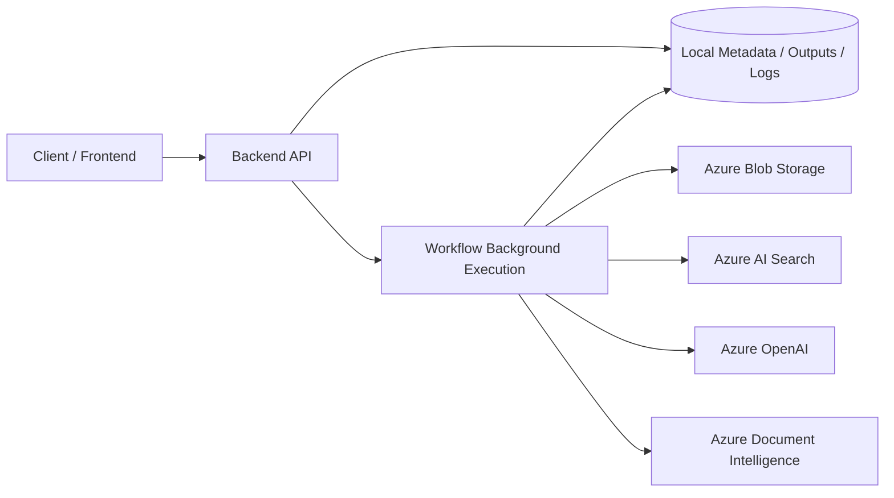

# 01 - System Context Diagram

## Purpose
Show the project boundary, primary actors, and external dependencies.

## Questions Answered
- Who uses the backend?
- Which external systems does it rely on?
- Where do outputs and metadata persist?

## Diagram

## Notes
- API starts workflow runs and exposes status/output endpoints.
- Worker path represents async execution via dispatcher/background mechanisms.
- Cloud dependencies are concentrated in ingestion/retrieval/generation runtime paths.
