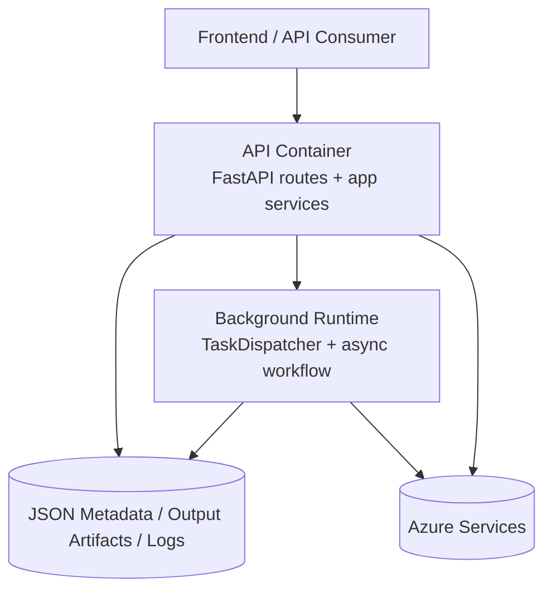

# 02 - Container Architecture Diagram

## Purpose
Show deployable/runtime containers and their interactions.

## Questions Answered
- What are the main runtime units?
- Which unit talks to storage and cloud services?
- How does background execution fit in?

## Diagram

## Notes
- API and background runtime may run in same process in current setup, but are separated logically here.
- Industrial scaling can split background runtime into dedicated worker processes.
