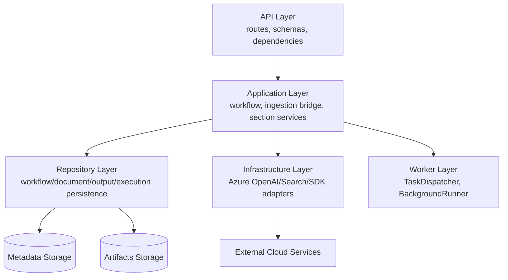

# 03 - Layered Architecture Diagram

## Purpose
Show code-level layering and dependency direction.

## Questions Answered
- Where should business logic live?
- Which layers can call which layers?
- How are persistence and external integrations separated?

## Diagram

## Notes
- `repositories` own local persistence contracts.
- `infrastructure` owns external service adapters.
- `workers` owns async dispatch mechanics.
