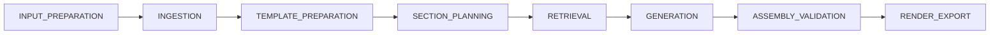

# 04 - Workflow Phases Diagram

## Purpose
Show the top-level end-to-end workflow pipeline phases.

## Questions Answered
- What is the full execution order?
- Which major lifecycle stages exist?
- Where does each request move over time?

## Diagram

## Notes
- These phases map to progress planning and workflow execution services.
- Progress is weighted per phase and rolled up into overall workflow progress.
