# 05 - Ingestion 9-Stage Pipeline Diagram

## Purpose
Show the exact ordered ingestion sub-stages used by the runtime.

## Questions Answered
- What does ingestion do internally?
- What is the exact stage order?
- Where should failures be localized when debugging ingestion?

## Diagram

```mermaid
flowchart LR
    S1[01_UPLOAD_AND_DEDUP] --> S2[02_PARSE_DOCUMENT]
    S2 --> S3[03_MASK_PII]
    S3 --> S4[04_CLASSIFY_IMAGES]
    S4 --> S5[05_VISION_EXTRACTION]
    S5 --> S6[06_SEGMENT_SECTIONS]
    S6 --> S7[07_VALIDATE_OUTPUTS]
    S7 --> S8[08_SEMANTIC_CHUNKING]
    S8 --> S9[09_VECTOR_INDEXING]
```

## Notes
- Stage names align with ingestion execution tracking and progress reporting.
- Output of this pipeline feeds retrieval readiness (indexed chunks).
