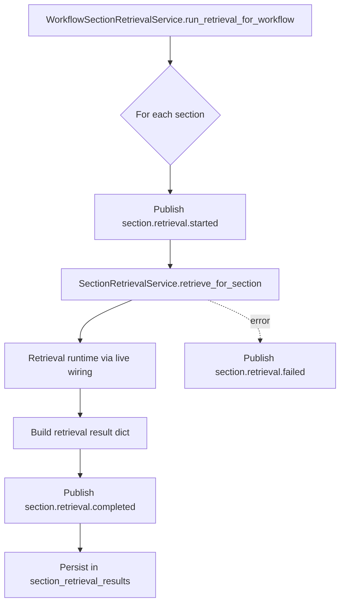

# 06 - Retrieval Flow Diagram

## Purpose
Show section-level retrieval orchestration from section plan to evidence bundle.

## Questions Answered
- How are sections retrieved one by one?
- Where are retrieval events emitted?
- What artifact is persisted for downstream generation?

## Diagram

## Notes
- Retrieval output includes diagnostics, evidence bundle, confidence, warnings, and cost summary.
- `section_retrieval_results` is the direct input for generation.
