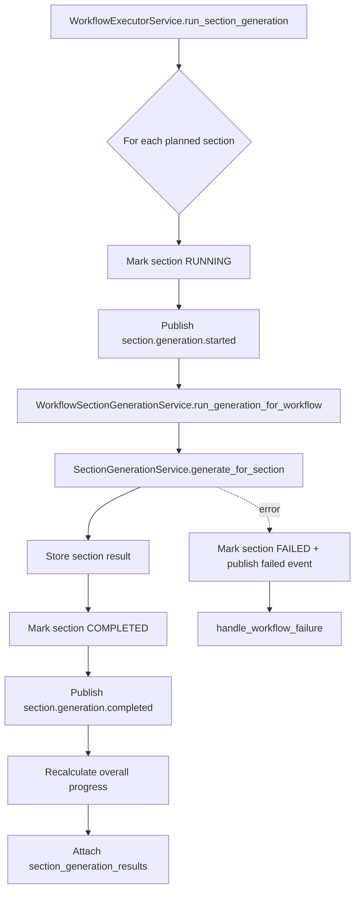

# 07 - Generation Flow Diagram

## Purpose
Show section-by-section generation using planned sections and retrieval outputs.

## Questions Answered
- How is generation orchestrated per section?
- How is section progress updated?
- What is stored after generation completes?

## Diagram

## Notes
- Section outputs can be text, table, or diagram artifacts.
- Diagnostics and estimated costs are aggregated into observability.
