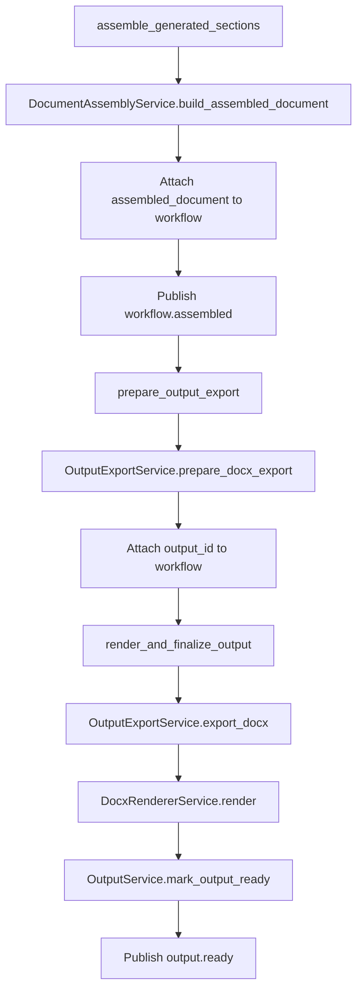

# 08 - Assembly and Export Flow Diagram

## Purpose
Show how generated sections become the final exported DOCX artifact.

## Questions Answered
- How are section outputs assembled?
- How is output metadata prepared and finalized?
- What marks workflow completion at document level?

## Diagram

## Notes
- Assembly validates all planned sections have generation outputs.
- Export path persists both output metadata and physical DOCX artifact path.
