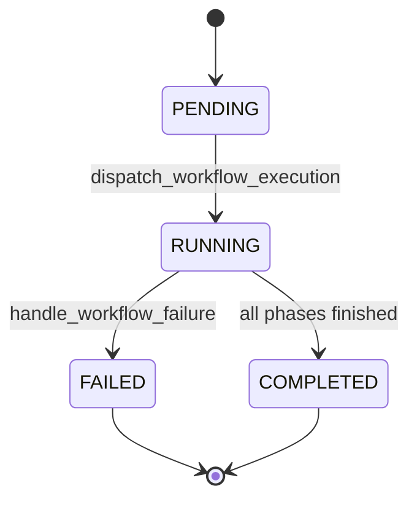

# 09 - Workflow State Machine Diagram

## Purpose
Define allowed lifecycle transitions for a workflow run.

## Questions Answered
- What statuses can a workflow enter?
- Which transitions are terminal?
- When is a workflow considered done?

## Diagram

## Notes
- `RUNNING` spans all major phases from input preparation through export.
- Any unrecoverable error path can force transition to `FAILED`.
