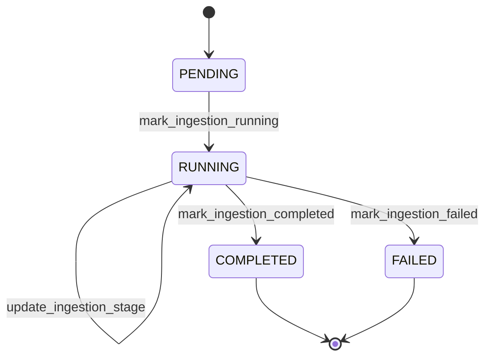

# 10 - Ingestion Execution State Machine Diagram

## Purpose
Define state transitions for ingestion child execution metadata.

## Questions Answered
- How does ingestion progress from start to finish?
- What state indicates successful indexing readiness?
- Where does ingestion failure terminate?

## Diagram

## Notes
- While in `RUNNING`, the `current_stage` and `completed_stages` fields evolve across 9 ingestion sub-stages.
- Completion implies ingestion pipeline reached vector indexing end-state.
