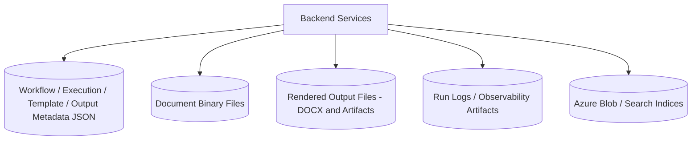

# 12 - Storage Layout Diagram

## Purpose
Map persistent storage categories and what each stores.

## Questions Answered
- Where are workflow and execution records stored?
- Where are binaries and generated outputs stored?
- How are logs/artifacts separated from metadata?

## Diagram

## Notes
- Metadata repositories are file-based JSON in the current architecture.
- Export renderer produces filesystem artifacts while cloud indexing stores retrieval-ready vectors.
