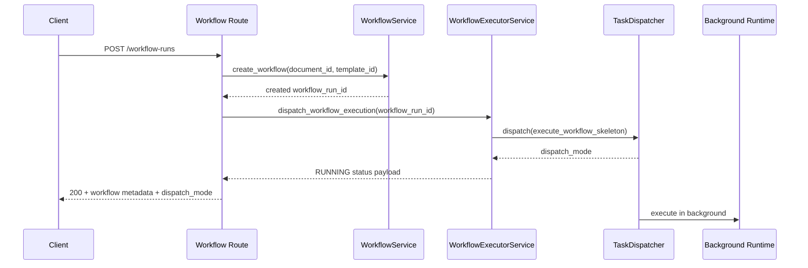

# 13 - API Sequence: Create Workflow

## Purpose
Show the request/response and asynchronous dispatch path for workflow creation.

## Questions Answered
- What happens after `POST /workflow-runs`?
- Where is async execution started?
- What is returned immediately vs processed in background?

## Diagram

## Notes
- API responds without waiting for entire workflow completion.
- Subsequent status/sections/observability endpoints expose progress and outputs.
