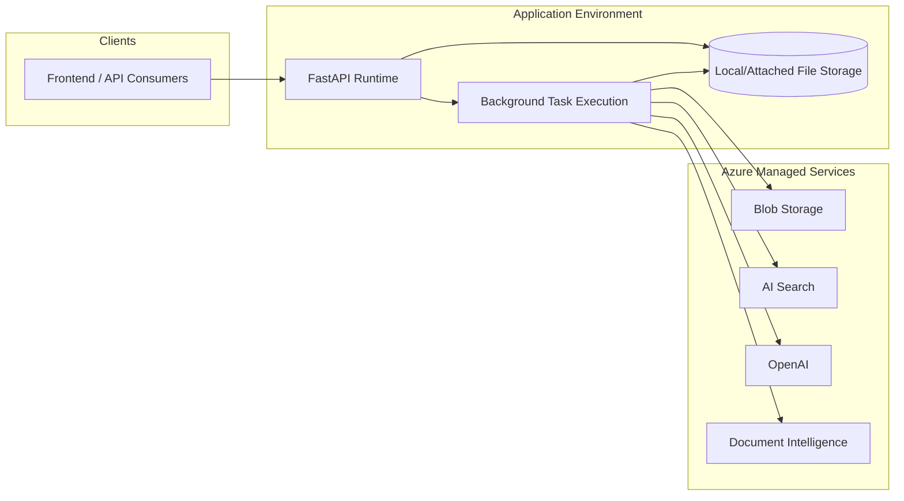

# 14 - Deployment Topology Diagram

## Purpose
Describe logical deployment topology across environments.

## Questions Answered
- Which runtime blocks exist in each environment?
- How does the backend interact with managed cloud services?
- Where do clients enter the system?

## Diagram

## Notes
- Current architecture can run API + background in one service process.
- Production hardening often separates worker runtime from API runtime.
