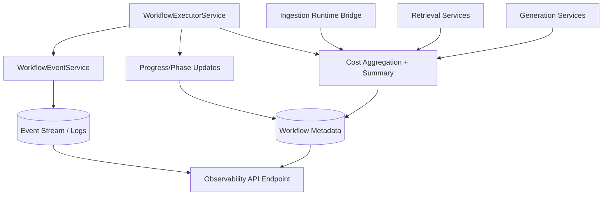

# 15 - Observability Model Diagram

## Purpose
Show where logs, events, progress, and cost summaries are produced and consumed.

## Questions Answered
- Which components emit operational telemetry?
- How are workflow-level observability summaries built?
- Which endpoints expose observability to clients?

## Diagram

## Notes
- Observability summary consolidates ingestion, retrieval, and generation costs.
- Status, phase progression, and diagnostics are read back through workflow endpoints.
