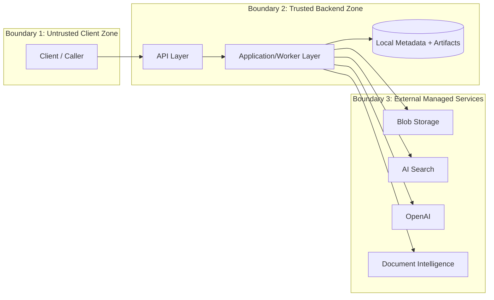

# 16 - Threat Model Diagram

## Purpose
Capture trust boundaries and high-level security risk surfaces.

## Questions Answered
- Where are trust boundaries in this architecture?
- Which paths carry sensitive document content?
- Which integrations require strict credential and access controls?

## Diagram

## Notes
- Key controls to document per boundary: authN/authZ, input validation, secret handling, encryption, logging, and retention.
- PII-sensitive paths are concentrated in ingestion and should have explicit masking/audit controls.
